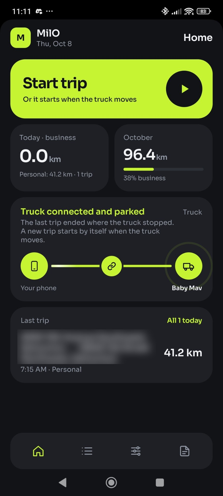
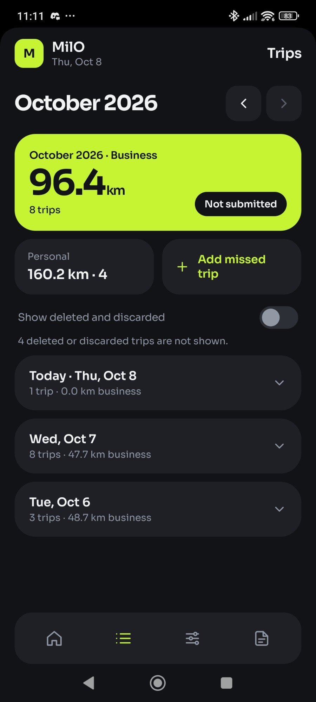
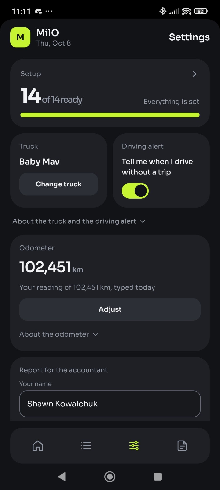
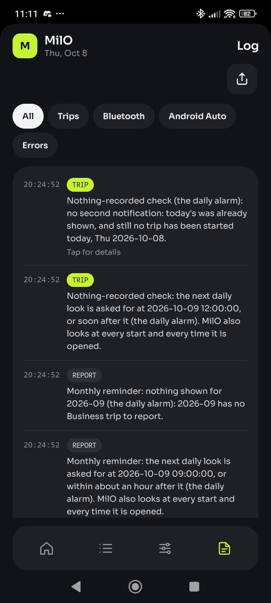
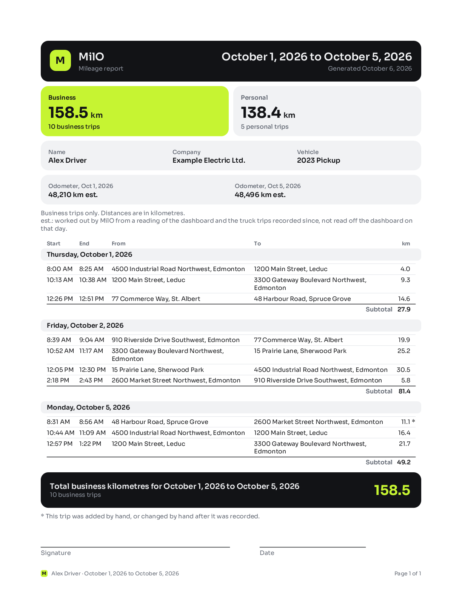

# MilO

<p align="center">
  <a href="https://github.com/shawnkowalchuk/MilO/releases/latest"></a>
  <br>
  <a href="https://github.com/shawnkowalchuk/MilO/releases/latest"><b>⬇️ Download Latest APK</b></a> · Android 14 or newer · <a href="#installing-the-apk">How to install</a> · <a href="https://milotriplog.top">milotriplog.top</a>
</p>

**An Android app that logs business kilometres by itself.** When the phone connects to the work truck's Bluetooth, MilO starts a trip, records the drive with GPS, sorts it into Business or Personal by the work hours, and at the end of the month makes the mileage report for the accountant, as a PDF and a CSV file.

<p align="center">
  
  
  
  
</p>

> **A personal project, public to read.** MilO was built by Shawn Kowalchuk for one phone (a Xiaomi POCO X5 Pro 5G on Android 14 and HyperOS 2.0) and one truck. It runs on Android 14 and newer. It is not on the Play Store, there is no support, and the code has no license: it is public to read, and all rights are reserved (see [License](#license)). Everything after [License](#license) is the owner's own guide to running it on that phone.

## What it does

**By itself**

- Starts a trip when the phone connects to the truck's Bluetooth, through Android's companion-device service, so it works with MilO closed. It records the drive with GPS and ends the trip two minutes after the truck disconnects.
- Ends a trip when the truck has stood still for ten minutes even though it is still connected (a parked truck can stay connected for hours), then watches beside it and starts the next trip when the truck drives off.
- Plays two sounds you can hear even on silent: one when it connects to the truck, one when the truck drives off. Each can be a built-in sound or an audio file of your own.
- Looks up each trip's start and end address.
- Saves each trip as Business or Personal by the work hours set in Settings.
- Keeps the truck's odometer from one reading typed in, plus every truck trip since.
- Reminds you from the 1st of the month until last month's report is sent, says so if a work day has no trip by noon, and notifies you if the phone reports driving while nothing is being recorded.
- Writes an event log of every Bluetooth change, every start and stop, and every crash.

**With you**

- Start and End by hand: on the phone, on the Android Auto screen, or on a home-screen widget that also shows this month's and this year's Business kilometres in dollars, at a rate per kilometre set in Settings.
- Edit, delete or add a missed trip on the Trips screen, and mark any trip Business or Personal.
- Show every distance in kilometres or miles, the report included: one setting, "Units", in Settings.
- Send the report: MilO opens the email app with the PDF attached, and you press send.
- Export and import all data as one file. Android's own backup carries the rest.

<p align="center">
  <br>
  <sub>A sample report page, drawn from the app's own layout code with made-up trips.</sub>
</p>

## Installing the APK

1. On the phone, open the [latest release](https://github.com/shawnkowalchuk/MilO/releases/latest) and download the `.apk` file under "Assets".
2. Open the downloaded file. The first time, Android asks you to allow the app you opened it with (your browser or Files) to **install unknown apps**: allow it, go back, and press Install. Developer options are not needed.
3. Google Play Protect may warn that the app is from an unknown developer, or offer to scan it. That is because MilO is not on the Play Store; choose to install anyway if you trust it.
4. Open MilO. A first page says what it does; **OK** leads to Setup: work through it (the permissions, then pairing your truck) and press **Done, go to Settings** at its end.

**To update,** install the newer APK over the old one: your trips and settings stay. Never uninstall MilO to update it, because that deletes every trip.

**Worth knowing first:** MilO is built and tested on one Xiaomi phone. On other phones the automatic start depends on how hard the maker stops apps in the background; Setup shows what it can check. The Android Auto screen is not expected to show on a car's display for an app installed this way (Android Auto shows apps from the Play Store). The phone side works the same with or without it.

## Privacy

MilO has no account, no server and **no internet permission**. Every trip stays on the phone. It leaves only in files you send or save yourself (the report, an export), in your own Android backup, and as coordinates handed to Android's Geocoder to look up an address. The screenshots above are from the owner's phone, with the street addresses on Home blurred.

## How it is built

Native Kotlin (2.4, with warnings as errors), Jetpack Compose with Material 3, Navigation 3, Room 3 on bundled SQLite, DataStore, the fused location provider, and the Car App Library for the Android Auto screen. One Gradle module, manual dependency injection, no backend. Every dependency is pinned to its latest stable release and kept current by Dependabot. CI runs gitleaks, Spotless with ktlint, Android Lint, the unit tests (over 2,000, all plain JVM tests) and a debug build on every pull request.

It was built with an AI coding assistant working from a small set of documents that are the project's memory: the rules (`docs/ENGINEERING_STANDARDS.md`), the map (`docs/ARCHITECTURE.md`), every feature and how it works, each with its status (`docs/APP_ENCYCLOPEDIA.md`), a dated journal of every change and decision (`docs/FINDINGS_LOG.md`), and the checks only the phone can run (`docs/DEVICE_TEST_CHECKLIST.md`). [For developers](#for-developers) has more.

## Status

Version 0.1.0, in daily use on the owner's phone since 2026-10-06.

- **Proven in the truck:** pairing the truck; trips started by the truck's Bluetooth and ended by its disconnect (2026-10-06); the parked rule ending a trip, and the watch starting the next one when the truck moved (2026-10-07); Start by hand; the Setup checklist's permission rows.
- **Built and unit tested, not yet seen on the phone:** among others the Android Auto screen (it has run nowhere), the home-screen widget, emailing the report, the driving alert and the daily check.

Each entry of `docs/APP_ENCYCLOPEDIA.md` opens with a status line that says what the phone has proven, and `docs/DEVICE_TEST_CHECKLIST.md` lists what it still has to show.

## License

No license. The code is public so that it can be read; all rights are reserved, and it may not be copied, changed or redistributed without permission. The typeface, Sora, is under the SIL Open Font License 1.1 (`licenses/Sora-OFL.txt`).

---

# The owner's guide

The rest of this page is written for the owner and the one phone MilO runs on: installing it from the Mac, setting it up, the HyperOS settings it needs, and everyday use.

## Install and run from Android Studio

**Not tried yet in Android Studio itself.** Every build so far was put on the phone from the terminal over USB. Opening the project in Android Studio, its first sync and its Run button are untried with this project, so the steps below are what is expected, not what was seen. The terminal way further down is the one that has worked.

### What the Mac needs

- Android Studio Rabbit 1 2026.2.1 (or Quail 4 2026.1.4). An older Android Studio cannot open this project.
- SDK platform 37, from Android Studio's SDK Manager. It is installed on the Mac mini.
- Nothing else. The project brings its own Gradle and asks for Java 17, which the Mac has.

### Open the project and let it sync

1. In Android Studio choose **File, Open** and pick the `MilO` folder itself (the one that holds `settings.gradle.kts`), not the `app` folder inside it.
2. If Android Studio asks whether to trust the project, say yes.
3. Wait for the first sync to finish. It reads the build files and fetches what is missing, which takes a few minutes and needs the internet. The bar at the bottom says when it is done.
4. Android Studio writes `local.properties`, the file that says where the Android SDK is. Git ignores that file on purpose.

### The signing key

Android only lets a new build replace the MilO on the phone if both are signed with the same key. MilO has one key of its own for that.

- The key is the file `~/keys/milo.jks`. Its password is in the macOS Keychain under the name `milo-keystore`. Neither is in the project folder or on GitHub.
- **The build finds both by itself.** You should not be asked for a password, and there is nothing to set up in Android Studio's signing dialogs.
- If the key file or the Keychain entry is missing, the build stops and says what to do. It never signs with another key in silence.
- **If Android Studio ever says the app on the phone has a different signature and offers to uninstall it, press Cancel.** Uninstalling deletes every trip. Ask for help with the key first.
- Not yet confirmed in Android Studio: that Run installs a build signed with this key. A sync is handed a placeholder in place of the password, so that Android Studio cannot save it. After the first Run, check that MilO was updated in place and your trips are still there.

### Run it on the phone

1. Connect the phone to the Mac with the USB cable and unlock it. If the phone asks whether to allow USB debugging from this computer, allow it.
2. In Android Studio's toolbar, pick the phone in the device list. The configuration beside it is `app`.
3. Press **Run** (the green triangle). Android Studio builds MilO, installs it over the one on the phone and opens it.
4. Keep the phone in your hand until MilO is open: HyperOS asks on the phone before it installs (below).

### What to expect on HyperOS

- **Developer options are already set on your phone.** HyperOS needs three switches for an install from the Mac: "USB debugging", "Install via USB" and "USB debugging (Security settings)". Read from the phone on 2026-10-05, the two Xiaomi ones were on. Nothing to change.
- If they are ever switched off again (*from the research notes for HyperOS, check on your phone*): Settings, About phone, tap "OS version" seven times; then Settings, Additional settings, Developer options. Switching "Install via USB" on is reported to need a signed-in Xiaomi account, a SIM in the phone, and mobile data on with Wi-Fi off.
- **The "Install via USB" prompt.** At each install the phone is reported to show a prompt with a countdown of a few seconds. Press Install before it runs out. If you miss it, Android Studio reports `INSTALL_FAILED_USER_RESTRICTED`; press Run again. (*From the research notes for HyperOS, check on your phone.* The installs so far went through the first time; whether the prompt showed was not written down.)
- **MilO may start by itself right after an install.** Seen on your phone on 2026-10-06: HyperOS started MilO straight after the update, with Background autostart on.
- **An update can take a moment before MilO opens.** If the new build stores trips in a newer form, it converts what the phone holds first. Your trips are kept.

---

## First-time setup in the app

**The first time MilO opens** (and once on a phone that already had it, after the update that brings this; built on 2026-10-08, not yet seen on the phone), a page says what MilO does and how it works. **OK** opens Setup, which then has **Done, go to Settings** at its end: press it when you are happy with Setup, even with a row still to fix, and Settings opens for your work hours, name and the accountant's address. After that MilO opens on Home as usual, and Setup is where it always is:

Open MilO, press **Settings** in the bottom bar (its third button, three sliders; the bar shows icons and no words), and press the **Setup** tile at the top. Home's warning "Setup needs attention" opens it too. The screen lists everything MilO needs, each row with its state and a button that leads to the place to set it. The tile at its top says how many of the rows are ready. Until every required row is in order, the Home screen shows "Setup needs attention" and a trip may not start by itself.

On 2026-10-05 you went through this screen once, everything except pairing the truck. The Physical activity row was added after that.

### The rows, in order

A row that is to be fixed (a red mark) stands at the top of its group until it is in order; the tables give the order with nothing to fix.

"Android" (MilO reads the state of all ten by itself):

| # | Row | What to do |
|---|---|---|
| 1 | Precise location | Press Allow. Choose "While using the app", with Precise on. |
| 2 | Location: Allow all the time | Press Allow. Android opens its own location page for MilO: choose "Allow all the time". The button is there once row 1 is done. |
| 3 | Notifications | Press Allow. |
| 4 | Nearby devices (Bluetooth) | Press Allow. Without it no trip starts at all, not even with the Start trip button. |
| 5 | Location switched on | Location must be on for the whole phone. |
| 6 | Truck paired and watched | Leave this for last: see "Pair the truck" below. |
| 7 | Battery use: unrestricted | Press Open settings and allow MilO to run without battery optimisation. |
| 8 | Not paused when unused | Recommended. Switch off "Pause app activity if unused" for MilO. |
| 9 | Battery Saver off | The phone's Battery Saver must be off while you work. |
| 10 | Physical activity | Recommended. Only the driving alert needs it. |

"This Xiaomi phone (HyperOS)" (four rows; what each setting is for is in the next section):

| # | Row | What to do |
|---|---|---|
| 11 | Background autostart | Press Open settings, find MilO in the list and switch it on. The row then says "Looks on". |
| 12 | Battery saver: No restrictions | Press Open settings, choose "No restrictions", come back and press "I have set this". |
| 13 | Other permissions | Recommended. Press Open settings, switch the three on, come back and press "I have set this". |
| 14 | Locked in recent apps | No button: it is a gesture. Do it, then press "I have set this". |

A row you confirmed says "You confirmed this on (date). MilO cannot check it." If a button opens MilO's App info page in place of the page its row names, the setting is reported to be one tap further in from there (*from the research notes for HyperOS, check on your phone*); the Log screen then has an `ERROR` line that says which screen could not be opened. Whether each button opens the right HyperOS screen on your phone was not written down.

### Pair the truck

Do this at the truck, with every other row in order.

1. Pair the phone with the truck in the phone's own Bluetooth settings, if it is not paired already.
2. In MilO: Setup, the row "Truck paired and watched", **Pair truck**.
3. Under "Paired with this phone", find the truck and press **Pair**.
4. Android shows a dialog of its own and asks you to allow it. Choose **Allow**.
5. The screen says "Paired with (the truck's name)" and "Paired, and Android is watching for it. A trip starts by itself when it connects." On Setup the truck's row now has its tick, and the warning on Home is gone.

Bluetooth and Location must both be on for this, and the screen says so if one is not. The truck was paired this way on 2026-10-06, and started its first trips by itself that day. If the screen ever fails, `docs/DEVICE_TEST_CHECKLIST.md` ("Pairing MilO with the truck") has a second way from the Mac.

---

## Phone settings for the POCO X5 Pro (HyperOS 2.0)

HyperOS stops apps in the background harder than plain Android does. These are the settings that keep it from putting MilO to sleep. Why they matter comes from research into HyperOS, not from tests on your phone: the drives that prove them are checks 31 to 43 of `docs/DEVICE_TEST_CHECKLIST.md`.

**Every menu path below is from the research notes for HyperOS, and each is marked so.** The FINDINGS_LOG records what was read back from your phone (a permission granted, a switch on), never the path that was taken to set it, so none of the paths counts as confirmed. Menu names differ between HyperOS versions; if a path does not match, search the phone's Settings for the name of the switch. The research is in `docs/research/2026-10-03-miui-background-limits.md` and `docs/research/2026-10-03-miui-dev-bluetooth-audio.md`.

### 1. Background autostart: on

- **Where:** Settings, Apps, Permissions, Background autostart, MilO on. Or: Settings, Apps, Manage apps, MilO, Autostart. *(From the research notes for HyperOS, check on your phone.)*
- **Why:** it is the switch that lets HyperOS start a closed app. With it off, HyperOS is reported to drop the truck's Bluetooth signal and refuse to start MilO for it. It is off by default for an app you install yourself. This is the most important one.
- **MilO's Setup:** reads it, through an unofficial check, as "Looks on" or "Looks off". On your phone the reading answered and followed the switch (2026-10-05).
- **On your phone so far:** read as on, on 2026-10-05.

### 2. Battery saver for MilO: "No restrictions"

- **Where:** Settings, Apps, Manage apps, MilO, Battery saver, No restrictions. *(From the research notes for HyperOS, check on your phone.)*
- **Why:** it is the one choice of the four that is reported to keep Xiaomi's own freezer and automatic clean-ups away from an app.
- **MilO's Setup:** cannot read it. The row waits for "I have set this".
- **On your phone so far:** not recorded.

### 3. Battery optimisation exemption (Android's own)

- **Where:** MilO's Setup, the row "Battery use: unrestricted", Open settings, then allow. The research found no HyperOS menu path for it, so use the row's button.
- **Why:** it lets Android start a recording while MilO is in the background, and keeps Android's own battery saving off MilO. It is treated as a separate setting from number 2: set both.
- **MilO's Setup:** reads it.
- **On your phone so far:** granted, read from the phone on 2026-10-05.

### 4. "Pause app activity if unused": off

- **Where:** Settings, Apps, Manage apps, MilO, switch off "Pause app activity if unused". *(From the research notes for HyperOS, check on your phone.)*
- **Why:** with it on, Android takes an app's permissions away and stops its background work after months without being opened.
- **MilO's Setup:** reads it (the row "Not paused when unused", recommended). Whether HyperOS has this switch, and whether the row follows it there, is not known.
- **On your phone so far:** not recorded.

### 5. "Other permissions": three switches on

- **Where:** Settings, Apps, Manage apps, MilO, Other permissions. Switch on "Show on Lock screen", "Start in background" (also seen as "Display pop-up windows while running in the background" or "Open new windows while running in the background") and "Permanent notification". *(From the research notes for HyperOS, check on your phone.)*
- **Why:** they decide whether an app may show a screen from the background and keep its permanent notification. The research says a recording does not depend on them, and that apps of MilO's kind ask for them all the same; switching them on does no harm. The names on HyperOS 2.0 are not confirmed.
- **MilO's Setup:** cannot read them. One recommended row, which waits for "I have set this".
- **On your phone so far:** not recorded.

### 6. MilO locked in the recent apps

- **Where:** open MilO, open the recent apps, press and hold MilO's card, tap the padlock. *(From the research notes for HyperOS, check on your phone.)*
- **Why:** a locked app is left alone by the clear-all button and by Xiaomi's cleaners. It is not protected from a swipe on its own card, and not from every automatic clean-up.
- **MilO's Setup:** cannot read it, and has no button for it. The row waits for "I have set this".
- **On your phone so far:** not recorded.

### 7. Location: "Allow all the time"

- **Where:** MilO's Setup, the row "Location: Allow all the time", Allow. By hand: Settings, Apps, Manage apps, MilO, Permissions, Location, "Allow all the time", with "Use precise location" on. *(From the research notes for HyperOS, check on your phone.)* That it is granted was read from the phone; the path was not written down.
- **Why:** a trip that starts by itself starts while MilO is closed. Android 14 refuses to start a location recording from the background without it, and there is no way round that.
- **MilO's Setup:** reads it.
- **On your phone so far:** granted, read from the phone on 2026-10-05.

### What MilO's Setup can read, in one place

| Setting | Setup reads it? |
|---|---|
| Background autostart | Yes, through an unofficial check ("Looks on" / "Looks off") |
| Battery saver "No restrictions" | No. You confirm it |
| Battery optimisation exemption | Yes |
| "Pause app activity if unused" | Yes (unproven on HyperOS) |
| "Other permissions" | No. You confirm it |
| Locked in recent apps | No. You confirm it |
| Location "Allow all the time" | Yes |
| Precise location, Notifications, Nearby devices, Physical activity | Yes |
| Location switched on, the phone's Battery Saver | Yes (whether the row sees HyperOS's own Battery saver and Ultra battery saver modes is not known) |

What you confirmed is your word, with its date. HyperOS is reported to put some of these settings back after a system update or a restart. **After a system update, go through Setup again.**

### Habits

- **Do not force stop MilO.** A force-stopped app is told nothing by Android until you open it again: no trip starts.
- **Do not swipe MilO away** in the recent apps. While it waits for the truck, a swipe ends it even when it is locked, and only Background autostart brings it back.
- **Avoid the clear-all button** (the X in the recent apps) and the Security app's Cleaner and Boost speed on work days. Clear-all is reported to end apps that are not locked, a recording included.
- **Keep Battery saver mode off on work days.** Settings, Battery, Current mode: Balanced or Performance, not Battery saver or Ultra battery saver. *(From the research notes for HyperOS, check on your phone.)*
- **Keep the alarm volume up: both sounds follow it.** Since 2026-10-07 the sound (since 2026-10-08 both sounds, the connect sound and the trip-start sound) is played like an alarm, so that it is heard when the phone is on silent, on vibrate, in Do Not Disturb or in Bedtime mode. (On 2026-10-05 Bedtime mode silenced it on your phone; the trip was recorded all the same.) A Do Not Disturb that is set to silence alarms too still silences it. *(Not yet tried on your phone: device checks NL-70 to NL-74.)*
- **After the phone restarts, unlock it once.** Android holds Bluetooth events back until the first unlock.
- **Do not press "Back up now" in the phone's Google settings during a trip.** On an emulator a backup that was asked for from the Mac ended MilO in the middle of a recording. Whether the phone's own button does the same is not known.

Two more settings from the same research notes, which MilO's Setup does not show: Settings, Battery, the cog or "Additional features": set "Clear cache when device is locked" and "Turn off mobile data when device is locked" to Never. *(From the research notes for HyperOS, check on your phone.)*

---

## Everyday use

This is what is built. A start by the truck and an end by its disconnect were seen on 2026-10-06; an end because the truck stood still, and the next trip started when it drove off, on 2026-10-07.

**When a trip starts.** The truck's Bluetooth connects, and within seconds:

- the connect sound plays once from the phone, at the alarm volume;
- a notification "Trip in progress" appears and stays, with the kilometres so far;
- Home turns its lime tile into the trip: "Recording", the kilometres so far, the minutes it has run and "since (time)", and the button End trip. Its small Truck tile says "Connected".

**When the truck drives off** (since 2026-10-08), the trip-start sound plays once: the first time MilO sees the truck moving at 15 km/h or more. After the connect sound when the truck connected, and on its own when a parked truck drives off and the next trip starts. *Not yet tried anywhere but in unit tests: device checks TS-1 to TS-10.*

If Home is open at that moment, its truck tile first says "Connecting…" and then "Connected", for about four seconds, and only then does the lime tile change. The trip is being recorded all that time. Built on 2026-10-07 and seen on an emulator only.

**When a trip ends.** In one of two ways, whichever comes first.

- **The truck disconnects.** Home and the notification say "Trip in progress. Waiting for the truck to reconnect" for two minutes; reconnecting in that time continues the same trip. Then the trip ends and the notification goes.
- **The truck has not moved for ten minutes,** connected or not. The trip ends where and when the truck stopped, not ten minutes later. A stop of ten minutes or more therefore cuts a drive into two trips; the ten minutes can be set from 5 to 30 in Settings.

Either way there is no sound, and the trip is the "Last trip" on Home and a row on the Trips screen, with its times, from and to addresses, Business or Personal, and kilometres. A trip under 0.3 km is discarded and can be counted after all on Trips.

**"Truck connected and parked".** Your truck can stay connected to the phone long after it is switched off. When a trip has ended because the truck stood still and the truck is still connected (by Bluetooth, or by Android Auto on the cable), the notification stays and says "Truck connected and parked", "A trip starts when the truck moves", and the truck's tile on Home says the same. Nothing is being recorded. For the first hour MilO looks at the phone's position every 30 seconds, and every 5 seconds for ten minutes after the phone reports that you got into a vehicle; after the hour it turns GPS off and lets that report from the phone's motion sensor turn it back on. When the truck drives off (at 15 km/h or more), a new trip starts by itself, from where the truck was parked, **without the trip-start sound**. When the truck finally disconnects, the notification goes. You can press Start trip at any time; the trip then starts from where the truck was parked too. While MilO waits there is no End trip button: the lime tile on Home reads Start trip.

**If you end a trip yourself with End trip while the truck is still connected,** MilO does not wait. It starts nothing by itself until the truck has disconnected and connected again, or until twelve hours have passed and MilO is opened, or you press Start trip. If the truck stays connected all that time, as yours can, nothing tells you that the next drive is not being recorded: open MilO before you drive off, and press Start trip if the lime tile on Home reads Start trip. After a trip you started that way, a stop is waited out as before.

After three days of standing MilO stops watching, to spare the battery, and the truck's tile on Home says "Truck connected. MilO has stopped watching it". Open MilO or press Start trip before you drive off then.

**If a trip did not start.** Press **Start trip** on Home, on the home-screen widget or on the Android Auto screen; **End trip** ends it. If MilO tried and could not start, it posts "MilO could not start this trip. Tap to start". If the phone notices driving during the work hours with no trip being recorded and the truck not connected, it posts "You seem to be driving": tap it to start one (this needs the Physical activity row of Setup and a paired truck). A trip that was missed altogether is typed in on Trips with "Add missed trip".

**If MilO has stopped noticing the truck.** Once a day MilO asks itself whether a trip has been started. On a work day (a day that is switched on in the work schedule) that has none by 12:00 noon, it posts one notification: "No trip recorded today". If the truck has not been driven that day, there is nothing to do. If it has, tap the notification: MilO opens on Home, which says "Setup needs attention" if something it needs is switched off. The time and the switch are in Settings, on the card "Daily check"; a trip you add by hand does not count. Built on 2026-10-06 and seen on an emulator only: whether this phone lets MilO wake up for it at noon is one of the things still to be tried.

**Where things are.**

| What | Where |
|---|---|
| Start trip and End trip, the trip in progress, today's and the month's Business kilometres, whether the truck is connected, the last trip | **Home**, the first button of the bottom bar (a house) |
| Every trip, a month at a time: press a day to see its trips, and a trip to edit it, mark it Business or Personal, or delete it; add a missed trip | **Trips**, the second button (a list) |
| The report for the accountant | Trips, the dark pill on the month's lime tile (**Not submitted** or **Submitted**) |
| The truck and its odometer, your name, company, vehicle, the accountant's email address, the work hours, the three trip numbers (how long to wait for the truck to reconnect, how long it may stand still, the shortest trip that counts), kilometres or miles (the tile "Units"), the driving alert, the daily check, the reminder, the connect and trip-start sounds and the list of your own sounds, the home-screen widget and its rate, export and import | **Settings**, the third button (three sliders) |
| The permissions and phone settings, and the truck's pairing | **Setup**, the tile at the top of Settings |
| What MilO did and when | **Log**, the last button (a sheet of paper) |

**The report.** Set your name and the accountant's address in Settings first. The report is in the unit chosen in Settings under "Units" at the moment it is made: kilometres, or miles (built on 2026-10-07, not yet tried on the phone). On the Report screen, "Preview PDF" lets you look at it; **Email the report** opens the email app with the address, the subject and the PDF filled in. MilO sends nothing itself: press send there. Back in MilO it asks "Did you send it?"; "I sent it" marks the month as submitted. "Save PDF and CSV" hands both files to Android's share sheet, "Export CSV" the spreadsheet file alone, and "Mark as sent" records a report you sent some other way. No email draft has been seen yet, on any device: the emulator had no email account.

**The log, and how to send it.** The Log screen lists the newest lines first. Each day's lines are one tile, with the day above it (today's has none). The chips under the title show one kind of line at a time (Trips, Bluetooth, Android Auto, Errors); "Tap for details" opens what a line holds. **The square button beside the title shares the whole log:** it asks first, saying what the file holds, then makes a text file of every line and opens Android's share sheet: pick your email app and send it to whoever is helping you. The file names the truck and the phone's other Bluetooth devices with their addresses, and every address you typed on the edit screen. It holds no GPS position. Lines older than 90 days are removed, except the newest 1,000.

MilO only sees Android Auto connect or disconnect while MilO itself is running; a connection that came and went while it was closed is not in the log.

---

## Backups

There are three things to keep. The first two are yours to do.

**1. An export file.** Settings, the last tile ("Backup, export and import"), **Export**, with "Include the GPS points" left on. Android's file picker asks where to put `MilO-export-(date).json`: choose Downloads or Drive, then copy the file off the phone. Make one after each month's report, and before each update of MilO. It is the one copy that depends on nothing else: not the signing key, not a Google account, not this phone. "Import data" on the same card puts such a file back, and replaces everything the phone holds.

**2. The signing key and its password.** Copy `~/keys/milo.jks` to somewhere that is not the Mac, and keep its password with it (it is in the macOS Keychain under `milo-keystore`; a password manager is a good place for the copy). Never put the password in a file inside the project. Without the key and its password, a new build cannot replace the MilO on the phone: the only way forward would be to uninstall, which deletes the trips, and Android's backup would then refuse to restore them.

**3. Android's own backup.** If Google's backup is switched on for the phone, Android copies MilO's trips, sent reports, settings and event log to your Google account by itself, and gives them back when MilO is installed afresh with the same signing key. The raw GPS points are not in it. **It has never been seen to happen on your phone**, and a restore cannot be tried there without removing MilO. When Android has collected a backup, the Log says so in a `PROCESS` line ("Android collected MilO's data for a cloud backup …"). Until that line has been seen, count on the export file only.

**Never uninstall MilO to see whether a restore works.**

---

## Updating the app

1. Make an export first (above). If the MilO on the phone does not have that card yet: the last install the FINDINGS_LOG records, on the morning of 2026-10-06, is of a build from before the export existed. The trips the phone held then were copied to `~/MilO-backups/` on the Mac before that install, and check 232 of `docs/DEVICE_TEST_CHECKLIST.md` says how to take such a copy again.
2. Get the new code. In Android Studio: Git, Pull. Or in a terminal in the `MilO` folder:

   ```bash
   git pull
   ```

3. Connect the phone and press **Run**, as for the first install. The new build replaces the old one in place and keeps every trip and setting.

**Updates only go forward.** Never install an older build over a newer one. A newer build may store trips in a form an older one cannot read, and the older build then stops at every start. Until the first release every build called itself version 0.1.0, so Android did not prevent it; each release raises the number (For developers, "Making a release"), and Android then refuses an older build over a newer one. If it happens, no trip is lost: install the newer build again.

**Never uninstall MilO to fix a problem,** and never clear its data. Both delete every trip. If MilO misbehaves: open the Log, share it, and install a fixed build over the one on the phone.

After an update, open MilO once and look at Setup.

---

## For developers

### Building from the terminal

Needs Android Studio Rabbit 1 2026.2.1 (or Quail 4 2026.1.4) for the IDE, SDK platform 37 and JDK 17. Details are in `docs/adr/ADR-001-stack-selection.md`.

The build. This is the command CI runs: format check, lint, unit tests, debug APK.

```bash
./gradlew spotlessCheck lintDebug testDebugUnitTest assembleDebug
```

A terminal build has to be told where the Android SDK is. That path is in `local.properties`, which git ignores, so a new clone stops with "SDK location not found". Either open the project once in Android Studio, which writes the file, or set the path in the shell:

```bash
export ANDROID_HOME="$HOME/Library/Android/sdk"
```

Install on the connected phone (USB debugging on, the HyperOS switches as above). This is how every build reached the phone so far:

```bash
./gradlew installDebug
```

**Signing.** Builds for the phone are signed with `~/keys/milo.jks`, whose password the build reads from the macOS Keychain entry `milo-keystore` each time. A missing keystore or entry stops the build with instructions. GitHub's CI has no key and signs the debug build with the throwaway debug key. To do the same on another machine:

```bash
./gradlew assembleDebug -Pmilo.signing.debugKey=true
```

Never install that build on the phone: it cannot update the real one.

**Your own connect sound, in builds from this Mac.** The repo ships two original synthesized sounds, a chirp for the connect sound and a chime for the trip-start sound (`tools/make_trip_start_chirp.py`). A file saved as `app/src/debug/res/raw/trip_start_chirp.mp3` (or `.wav` / `.ogg`; the name must be `trip_start_chirp`) replaces it in debug builds made on this machine. That folder is git-ignored on purpose: a personal clip may be someone else's copyright and must stay off GitHub. Delete the file to go back to the bundled chirp. There is no such file for the chime. (Settings in the app can also choose any audio file on the phone for either sound, without a rebuild: that is how the Mario, Mario Kart and "Giggity" clips go in, since they are someone else's recordings and the repository is public. Put them on the phone, then "Add a sound" on either sound's tile; once added, a clip can be chosen for both.)

**The typeface.** The screens are set in Sora, which the app carries as `app/src/main/res/font/sora.ttf`. Its licence, the SIL Open Font License 1.1, is `licenses/Sora-OFL.txt`, and stays in the repository for as long as the font does.

### Making a release

Each update that others can download is a GitHub Release with the APK attached. It is built and signed on the Mac, with the same key as the phone's MilO, and uploaded by hand, so the key never leaves the Mac (the owner's choice of 2026-10-08, over building it on GitHub). The download button at the top of this page always opens the newest release.

1. **Start from `main`,** with everything merged: `git checkout main && git pull`.
2. **Raise the version** in `app/build.gradle.kts`: `versionCode` up by one, and `versionName` to the new number (`0.2.0`). Merge that as its own small pull request. The first release, `0.1.0`, skips this step.
3. **Build the release APK:**

   ```bash
   ./gradlew assembleRelease
   ```

   It is signed with `~/keys/milo.jks`, like the phone's builds. The file is `app/build/outputs/apk/release/app-release.apk`; rename it `MilO-0.2.0.apk`.
4. **Publish it.** On GitHub: Releases, **Draft a new release**, tag `v0.2.0` on `main`, title "MilO 0.2.0", a few lines on what changed (the FINDINGS_LOG has them), drop the APK on "Attach binaries", **Publish release**. Or with GitHub's command-line tool:

   ```bash
   gh release create v0.2.0 MilO-0.2.0.apk --title "MilO 0.2.0" --notes "What changed"
   ```

5. **Never publish an APK from CI, or one built with `-Pmilo.signing.debugKey=true`.** Both carry the throwaway debug key and could not update anyone's MilO.

Because a release is signed with the phone's own key, its APK also installs over the phone's MilO, and the trips stay. **No release build has been made yet:** before publishing the first one, install its APK on the phone and look it over.

### The website

`https://milotriplog.top` is a landing page and a privacy policy (ADR-003): plain HTML and CSS in `website/`, served by Firebase Hosting from the Firebase project `milotriplog`. **A merge to `main` that changes `website/` puts it live by itself** (`.github/workflows/website.yml`); the Actions tab's "Website", **Run workflow**, does the same by hand. The app has nothing to do with it and gets no Firebase.

To look at a change before merging, open `website/index.html` in a browser, or run `firebase serve --only hosting` in the repository and open the address it prints.

**The privacy page makes promises about the app.** A change to what the app keeps or sends changes `website/privacy.html` in the same pull request.

**Setting it up, once** (as for reactimate.top):

1. **The project ID is `milotriplog`** (Firebase console, the cog, **Project settings**; checked on 2026-10-08). `.firebaserc` and the secret's name in `.github/workflows/website.yml` depend on it. The free Spark plan is enough: it includes Hosting and a custom domain.
2. **Switch Hosting on:** Firebase console, **Build**, **Hosting**, **Get started**. Click through; the command-line steps it shows are already done in this repository.
3. **Make the deploy key and give it to GitHub,** once, on any computer, in an empty folder of its own (the files it writes there are not wanted, and the folder is deleted afterwards):
   - **On a Windows PC** (how it was done on 2026-10-08): download the Firebase tool as one program, [firebase-tools-instant-win.exe](https://firebase.tools/bin/win/instant/latest), and open it: it opens a window where `firebase` works. There, `mkdir %USERPROFILE%\milo-setup`, then `cd %USERPROFILE%\milo-setup`.
   - **On the Mac:** `npm install -g firebase-tools`, then `mkdir ~/milo-setup && cd ~/milo-setup`.

   Then `firebase login`, and `firebase init hosting`, answering: proceed **Y**; **Use an existing project**, `milotriplog`; public directory: press Enter; single-page app **N**; **set up automatic builds and deploys with GitHub: Y**; the repository `shawnkowalchuk/MilO` (it signs in to GitHub in the browser); run a build script **N**; automatic deployment when a pull request is merged **N** (MilO has its own workflow). It makes a service account that may deploy to Hosting and nothing more, and stores its key in GitHub as the secret `FIREBASE_SERVICE_ACCOUNT_MILOTRIPLOG` (GitHub, the repository's **Settings**, **Secrets and variables**, **Actions**, where it can be checked). Then delete the `milo-setup` folder. (`firebase init hosting:github` alone refuses to run in a folder without this repository's `firebase.json`: "Didn't find a Hosting config in firebase.json".) The key is never saved in the repository; do not download one from the Firebase console.
4. **Deploy:** merge a change to `website/`, or run "Website" from the Actions tab. The site is then at `https://milotriplog.web.app`.
5. **Connect the domain:** Firebase console, **Hosting**, **Add custom domain**, `milotriplog.top`. Firebase shows the DNS records to enter at the registrar `milotriplog.top` was bought from (a TXT record that proves it is yours, then the A record): enter them there, and press **Verify**. Then add `www.milotriplog.top` the same way, set to redirect to `milotriplog.top`. Firebase makes the HTTPS certificate itself, within minutes or up to a day.

**If the key ever leaks,** delete it in the Google Cloud console (IAM, **Service accounts**, the `github-action-…` account, **Keys**) and run step 3 again. It can replace the website and nothing else.

### The pre-commit hook

One-time setup, per clone. Turn the hook on:

```bash
git config core.hooksPath .githooks
```

Install gitleaks, which the hook uses to scan staged changes for secrets. Without it the hook stops every commit and prints an install hint:

```bash
brew install gitleaks
```

The hook runs the gitleaks scan and then `spotlessCheck`. Lint, unit tests and the build are left to CI.

### The documentation system

The repo runs on a small set of documents that are its memory and rulebook. They exist to prevent two things: decisions made implicitly and re-argued in every feature, and lost context about what was built and why.

| File | What it is | You open it to answer |
|---|---|---|
| `CLAUDE.md` | Operating instructions for the AI assistant, read at the start of every session | (its standing orders: read before writing, log after) |
| `docs/ENGINEERING_STANDARDS.md` | The rules: how the app is built | "How should I do X?" |
| `docs/ARCHITECTURE.md` | The map: the system's shape, stack, data flow, what the two UI surfaces share | "What connects to what?" |
| `docs/APP_ENCYCLOPEDIA.md` | The reference: every capability and how it works, each with a status line | "Have I built this? How does it behave? Is it proven on the phone?" |
| `docs/FINDINGS_LOG.md` | The journal: a dated record of every change, decision and finding | "What happened, and why this way?" |
| `docs/DEVICE_TEST_CHECKLIST.md` | The checks only the phone can run | "What is still unproven?" |

ADRs for big individual decisions are in `docs/adr/`. Research notes are in `docs/research/`: dated evidence behind the ADRs, not kept current.

**Read order.** Starting fresh: `CLAUDE.md`, then `docs/ENGINEERING_STANDARDS.md`, then `docs/ARCHITECTURE.md`; skim `docs/APP_ENCYCLOPEDIA.md` to see what exists. With the AI assistant nothing special is needed: `CLAUDE.md` stays in the repo root and tells it to read the other four in `docs/` first.

**The loop, every change:**

```
READ   standards + architecture + the relevant encyclopedia entry
  ↓
ASK    phone UI, Android Auto screen, or both? reuse an existing pattern? already built?
  ↓
BUILD  the smallest correct version, matching existing patterns
  ↓
UPDATE the encyclopedia if behaviour changed
  ↓
LOG    append to the findings log: what changed and why
```

**Where to look when stuck.**

- "Did I already build this?": `docs/APP_ENCYCLOPEDIA.md`. Search before building; extend what exists.
- "Why did we do it this way?": `docs/FINDINGS_LOG.md`, then `docs/adr/`.
- "How am I supposed to do this?": `docs/ENGINEERING_STANDARDS.md`.
- "What is the shape of the system, and is this shared between the phone UI and the Android Auto screen?": `docs/ARCHITECTURE.md`.

**What was set up on day 1** (the full checklist is `docs/ENGINEERING_STANDARDS.md` §18): a GitHub repo (private until 2026-10-08, public since) with a `.gitignore` for build output, `local.properties` and keystores; one `:app` module with Kotlin `allWarningsAsErrors`, Android Lint `warningsAsErrors`, Spotless and ktlint; the pre-commit hook; the latest stable dependencies pinned as exact versions in `gradle/libs.versions.toml`, with Dependabot so they never go stale; gitleaks in CI; the package structure, design tokens and base components; CI on every PR; and the documents above with ADR-001. Left out on purpose, with the reasons in ADR-001: Sentry, staging and prod environments, a lockfile, detekt, Robolectric, Hilt, Renovate.

**Two habits that matter most.** Keep dependencies fresh continuously: Dependabot and pinned versions mean small updates in place of a once-a-year migration (STANDARDS §2). And write it down when you do it, not later: every feature gets an encyclopedia entry, every change a findings-log line.
