# MilO Trip Log: the marketing kit

Pictures and a video of MilO, ready to use: for Google Play, Product Hunt, social posts and the website. Made on 2026-10-10 from the app as it was that day (version 0.3.1), the website, and the mascot's Blender file. Nothing here is part of the app or of the website: the app's build and the website's deploy do not read this folder.

**Everything shows made-up trips, never real ones.** See "The screenshots" below.

**Before you post a picture, read "What the kit says, and what it does not".** The app is not on Google Play yet, and no picture here says it is.

| | | | |
|---|---|---|---|
| 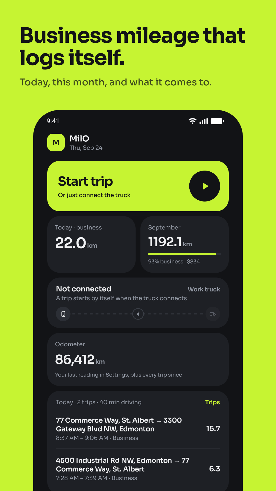 | 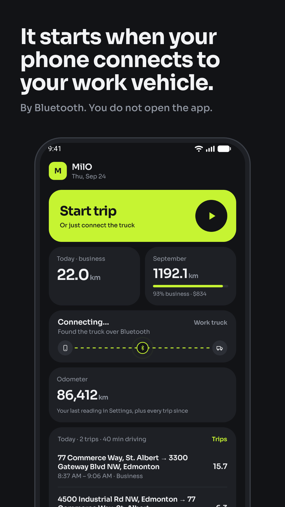 | 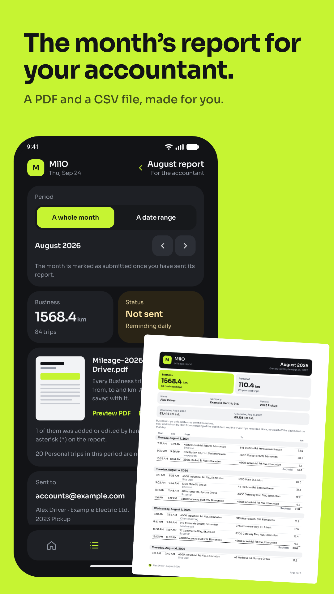 | 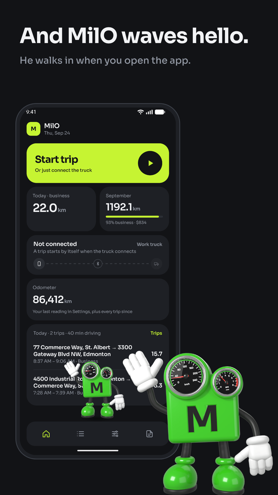 |
| Google Play, 1 of 8 | Google Play, 2 of 8 | Google Play, 6 of 8 | Google Play, 8 of 8 |
| 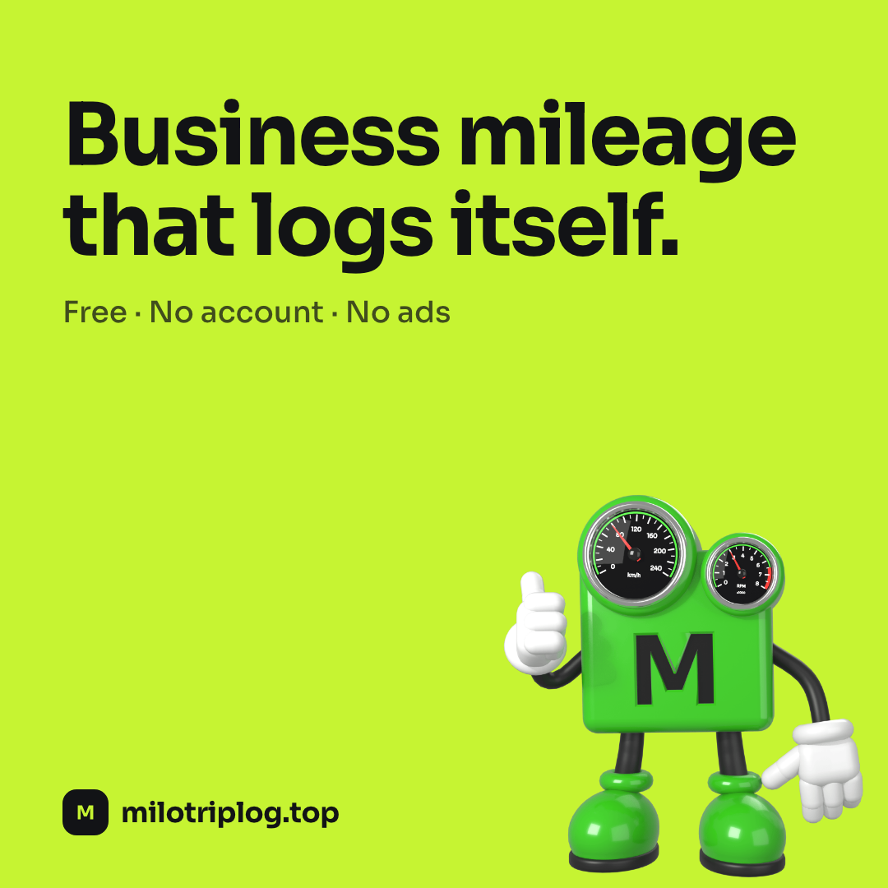 | 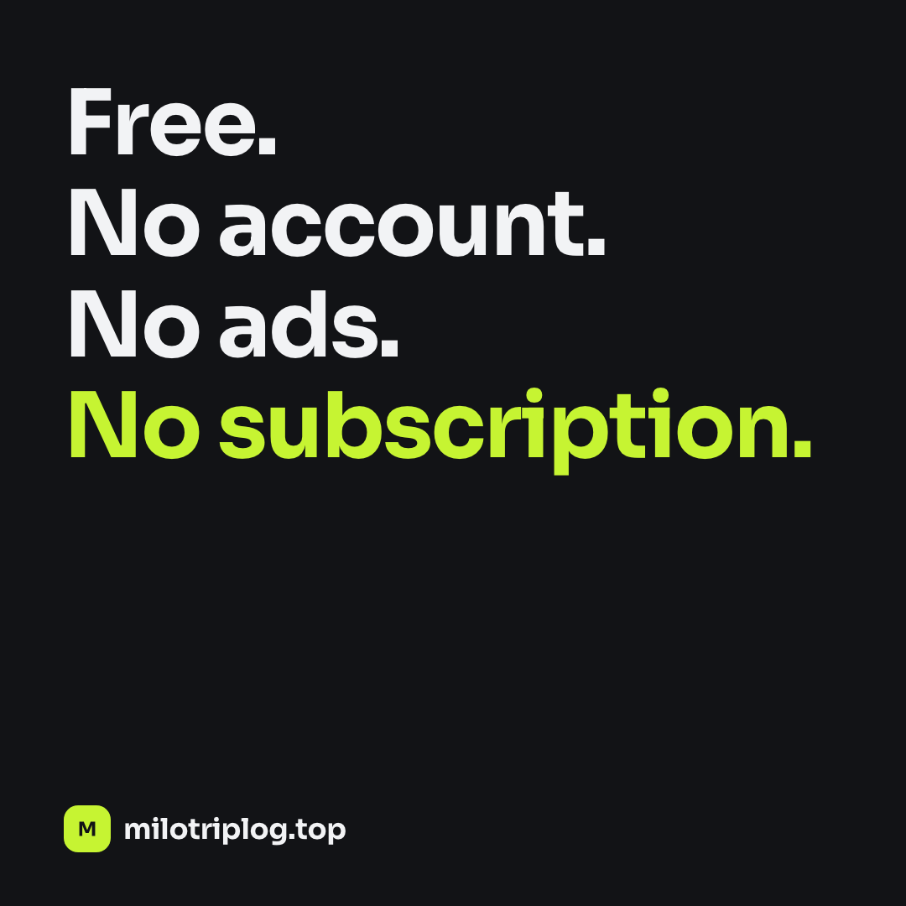 | 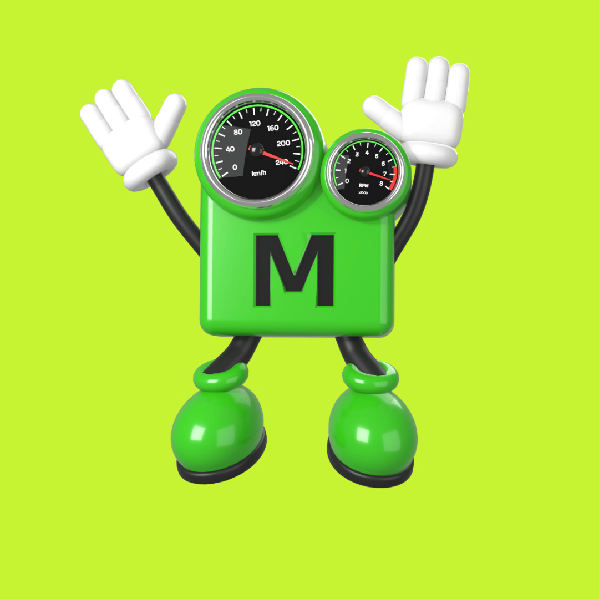 | 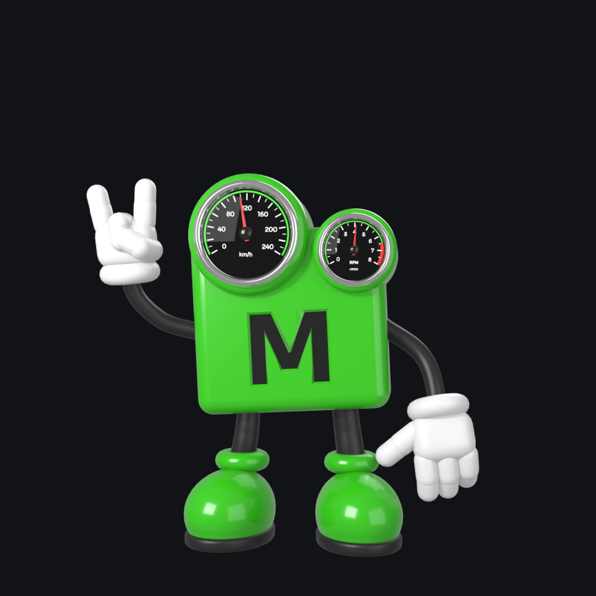 |
| Social square 1 | Social square 5 | Mascot on lime | Mascot on dark |

| | |
|---|---|
| 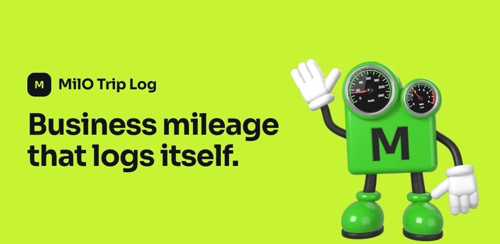 | 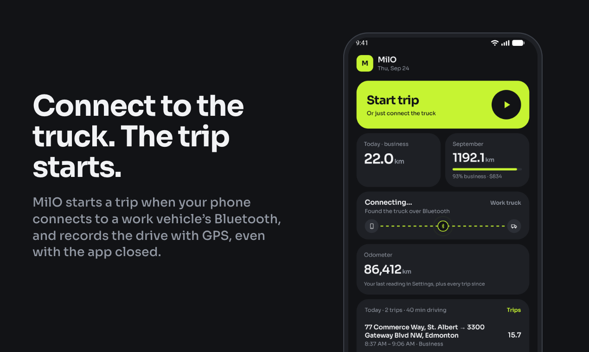 |
| Google Play feature graphic | Product Hunt gallery, 2 of 6 |
| 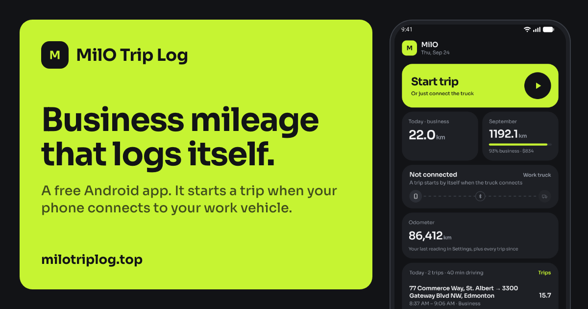 | 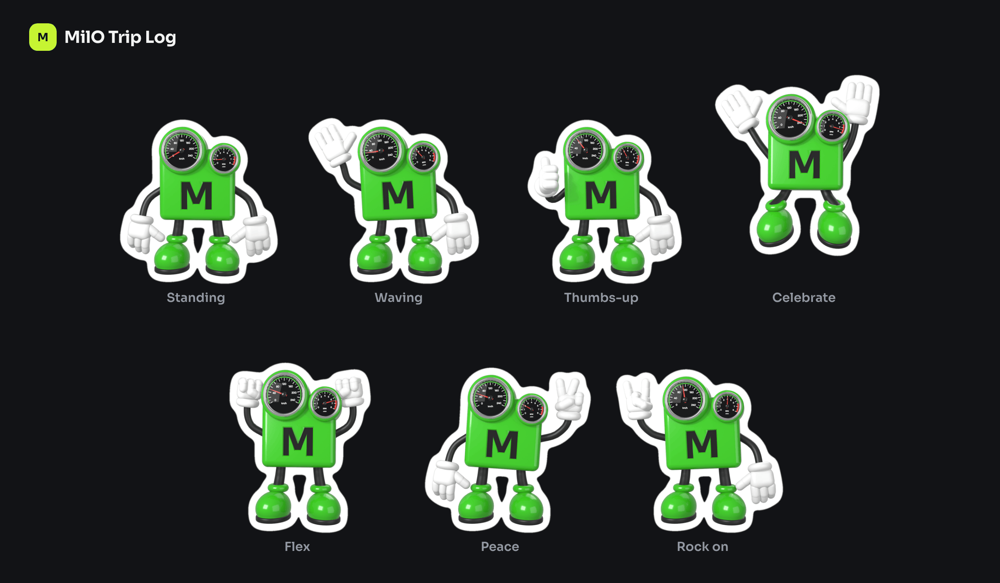 |
| Link picture A | The mascot's poses |
| 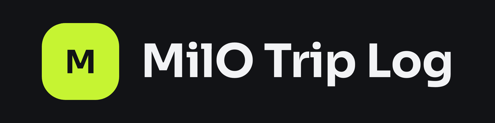 | 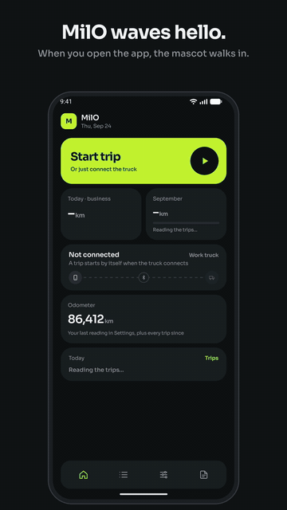 |
| The mark and the name | The mascot's opening (GIF) |

## Every file

Sizes are in pixels, width by height.

### `google-play/`

Google Play asks for phone screenshots of 9 to 16, a feature graphic of 1024 by 500, and an icon of 512 by 512. The screenshots are PNG without a see-through part, as it wants them. Their order tells the story; upload them in it.

| File | Size | What it says |
|---|---|---|
| `screenshot-1-home.png` | 1080 × 1920 | "Business mileage that logs itself." Home, on lime |
| `screenshot-2-starts-by-itself.png` | 1080 × 1920 | "It starts when your phone connects to your work vehicle." Home, as it finds the vehicle |
| `screenshot-3-recorded.png` | 1080 × 1920 | "The drive is recorded with GPS." Home, recording a trip |
| `screenshot-4-business-or-personal.png` | 1080 × 1920 | "Business or Personal, by your work hours." A day of trips, one of them pressed |
| `screenshot-5-labels.png` | 1080 × 1920 | "Say what each trip was for." The label picker |
| `screenshot-6-report.png` | 1080 × 1920 | "The month's report for your accountant." The report screen and the report's first page, on lime |
| `screenshot-7-private.png` | 1080 × 1920 | "Your trips stay on your phone." The app's own welcome page |
| `screenshot-8-mascot.png` | 1080 × 1920 | "And MilO waves hello." Home with the mascot waving, and the mascot large |
| `feature-graphic-1024x500.png` | 1024 × 500 | The name, the headline and the mascot, on lime |
| `icon-512.png` | 512 × 512 | The app's icon: a copy of `website/icon-512.png` |

### `product-hunt/`

Six gallery pictures that tell the story in order, and the thumbnail.

| File | Size | What it says |
|---|---|---|
| `gallery-1-problem.png` | 1270 × 760 | The problem: "A mileage log is easy to forget." |
| `gallery-2-starts-by-itself.png` | 1270 × 760 | "Connect to the truck. The trip starts." |
| `gallery-3-business-or-personal.png` | 1270 × 760 | "Business or Personal, by your work hours." |
| `gallery-4-monthly-report.png` | 1270 × 760 | "The month's report, made for you." The report's first page, on lime |
| `gallery-5-private-and-free.png` | 1270 × 760 | "Free, and your trips stay on your phone." |
| `gallery-6-mascot.png` | 1270 × 760 | "And MilO waves hello." On lime |
| `thumbnail-240.png` | 240 × 240 | The mark, square to the edge: Product Hunt rounds the corners itself |

### `social/`

| File | Size | What it is for |
|---|---|---|
| `link-1200x630-a-phone.png` | 1200 × 630 | The picture a shared link shows: the headline on a lime tile, and Home |
| `link-1200x630-b-mascot.png` | 1200 × 630 | The same use: the headline and the mascot, on lime |
| `link-1200x630-c-three-steps.png` | 1200 × 630 | The same use: the headline and the three steps |
| `square-1080-1-headline.png` | 1080 × 1080 | A post: the headline, thumbs-up |
| `square-1080-2-starts-by-itself.png` | 1080 × 1080 | A post: "Connect to the truck. The trip starts." |
| `square-1080-3-business-or-personal.png` | 1080 × 1080 | A post: "Business or Personal, by your work hours." |
| `square-1080-4-monthly-report.png` | 1080 × 1080 | A post: "The month's report for your accountant." |
| `square-1080-5-free.png` | 1080 × 1080 | A post: "Free. No account. No ads. No subscription." |
| `square-1080-6-private.png` | 1080 × 1080 | A post: "Your trips stay on your phone." |
| `story-1080x1920-1-mascot.png` | 1080 × 1920 | A story: the headline and the mascot |
| `story-1080x1920-2-starts-by-itself.png` | 1080 × 1920 | A story: Home, recording a trip |
| `story-1080x1920-3-monthly-report.png` | 1080 × 1920 | A story: the report's first page |
| `banner-1500x500.png` | 1500 × 500 | The wide picture at the top of a profile. Its left quarter is empty on purpose: a profile picture lies over it |

In the stories nothing that matters is in the top 250 or the bottom 340 pixels, which the app that shows a story covers with its own buttons.

### `mascot/`

The mascot in seven poses, drawn from `design/mascot/milo_mascot.blend` with the camera, the lights and the dulled dials of the app's own pictures. In every picture of a size he stands on the same spot, so one pose can take another's place without a jump.

| File | Size | What it is |
|---|---|---|
| `see-through/<pose>-2048.png` | 1776 × 2048 | The pose alone, the background see-through. Seven files: `standing`, `waving`, `thumbs-up`, `celebrate`, `flex`, `peace`, `rock-on` |
| `see-through/<pose>-1024.png` | 888 × 1024 | The same, half the size |
| `on-lime/<pose>-1080.jpg` | 1080 × 1080 | The pose on the lime. Seven files |
| `on-dark/<pose>-1080.jpg` | 1080 × 1080 | The pose on the dark page colour. Seven files |
| `sticker-sheet.png` | 2400 × 1400 | All seven with a white rim, as stickers are cut, and their names |
| `animated/wave.webp` | 920 × 776 | The wave as a moving picture with a see-through background: 49 frames, 24 a second, 2 seconds. The video's last scene is made from it |

### `logo/`

| File | Size | What it is |
|---|---|---|
| `mark.svg`, `mark-512.png`, `mark-2048.png` | square | The mark: the "M" on the lime square. The SVG is a copy of `website/mark.svg`; the PNGs have see-through corners |
| `mark-on-lime.svg`, `mark-on-lime-512.png`, `mark-on-lime-2048.png` | square | The mark for a lime ground: a lime "M" on the dark square |
| `lockup-on-dark.svg`, `-512.png`, `-2048.png` | 4 to 1 | The mark and "MilO Trip Log", on the dark page colour |
| `lockup-on-lime.svg`, `-512.png`, `-2048.png` | 4 to 1 | The same on the lime, with the dark mark |
| `lockup-see-through-light-words.svg`, `-512.png`, `-2048.png` | 4 to 1 | The same with nothing behind it and light words: for a dark ground of your own |
| `lockup-see-through-dark-words.svg`, `-512.png`, `-2048.png` | 4 to 1 | The same with dark words: for a light ground of your own |

The lockups' PNGs are 512 × 128 and 2048 × 512. In the SVG files the letters are outlines, so they look the same on a computer without the Sora typeface. The small "l" of "MilO" has a flag at its top and can look like a "1": that is how Sora draws it, in the app and on the website too.

### `screenshots/`

Every screen that was captured, as the emulator drew it, with nothing added: for any later use, and what the framed pictures above are made from.

| File | Size | What it shows |
|---|---|---|
| `welcome.png` | 1080 × 2400 | The page a new user sees first |
| `setup.png` | 1080 × 2400 | Setup with all ten rows in order |
| `home.png` | 1080 × 2400 | Home with no trip running |
| `home-vehicle-connecting.png` | 1080 × 2400 | Home as the phone finds the work vehicle: "Connecting…" |
| `home-recording.png` | 1080 × 2400 | Home recording a trip: 4.6 km, 5 minutes |
| `home-mascot-wave.png` | 1080 × 2400 | Home with the mascot in the middle of his wave |
| `home-report-waiting.png` | 1080 × 2400 | Home with the amber tile: last month's report is not sent yet |
| `trips-month.png` | 1080 × 2400 | Trips: September 2026 and its days |
| `trips-day.png` | 1080 × 2400 | Trips with one day opened: six trips, Business and Personal |
| `trips-trip-actions.png` | 1080 × 2400 | The same with one trip pressed: Edit, Label, Personal, Delete |
| `trips-august.png` | 1080 × 2400 | Trips: August 2026, submitted |
| `trip-label.png` | 1080 × 2400 | The label picker |
| `trip-edit.png` | 1080 × 2400 | A trip's edit screen |
| `report.png` | 1080 × 2400 | The report screen for August, not sent yet |
| `report-send.png` | 1080 × 2400 | Its lower part: "Email the report", "Save PDF and CSV", "Mark as sent" |
| `report-sent.png` | 1080 × 2400 | The same after "Mark as sent" |
| `report-page-1.png`, `report-page-5.png` | 1275 × 1650 | The first and the last page of the PDF the app made for August (below) |
| `settings-top.png` | 1080 × 2400 | Settings: Setup, the truck, the driving alert, the odometer |
| `settings-units-hours.png` | 1080 × 2400 | Settings: kilometres or miles, the work hours |
| `settings-sounds-widget.png` | 1080 × 2400 | Settings: the two sounds, the widget and its rate |
| `settings-end.png` | 1080 × 2400 | Settings' end: export and import, Email support, the version |
| `log.png` | 1080 × 2400 | The Log |
| `whats-new.png` | 1080 × 2400 | What's new, at version 0.3.0 |
| `widget.png`, `widget-recording.png` | 726 × 552 | The home-screen widget, cut out of the launcher with see-through corners: idle, and during a trip |
| `notification-report-reminder.png` | 996 × 316 | MilO's reminder that last month's report is not sent, cut out of Android's notification shade |

### `other/`

| File | Size | What it is |
|---|---|---|
| `website-1440x900.png` | 1440 × 900 | The website's front page as this repository has it, in a desktop's window |
| `android-auto-screen-800x480.png` | 800 × 480 | **Android Auto screen.** A drawing, not a screenshot (below) |
| `sample-report-august-2026.pdf` | 5 pages | The report itself, as the app made it from the made-up trips |

### `video/`

| File | Size | Length | What it is |
|---|---|---|---|
| `promo-vertical-1080x1920.mp4` | 1080 × 1920 | 29 s | The promo, upright: for stories, reels and shorts |
| `promo-horizontal-1920x1080.mp4` | 1920 × 1080 | 29 s | The same, lying: for YouTube, Product Hunt and the website |
| `opening-vertical-1080x1920.mp4` | 1080 × 1920 | 7 s | The promo's first scene alone: the mascot walks in, turns and waves |
| `opening-horizontal-1920x1080.mp4` | 1920 × 1080 | 7 s | The same, lying |
| `opening.gif` | 360 × 640 | 7 s | The same as a GIF that plays again and again, for places that take no video |
| `source/*.mp4` | 1080 × 2400 | | The five screen recordings the video is made from, each cut to its scene |

All four videos are MP4 with H.264 video (yuv420p, 30 frames a second). The promos have a sound track; the opening clips have none.

## The screenshots

- **The trips are made up.** `tools/demo_data.py` writes `demo/MilO-demo-export.json`: eight weeks of an electrician's driving around Edmonton, 193 trips, in the form of the app's own export file. It was brought into the app with Import, on Settings' last tile. The driver ("Alex Driver", "Example Electric Ltd.", "2023 Pickup", accounts@example.com) and the addresses are the invented ones of the website's sample report: street names that sound like a town's, with numbers that were never looked up. The vehicle is "Work truck". The odometer, 86,412 km, was typed in.
- **Two addresses are real street names.** While a trip is recorded, the app looks up where it started. The emulator was told it stood on Gateway Boulevard in Edmonton, so `home-recording.png` and two of the video's scenes say "From 4730 Gateway Boulevard Northwest, Edmonton". That is a commercial street; nobody lives or works there by this kit's doing.
- **The emulator.** Android 16 (API 36.1), 1080 by 2400 pixels, started for this and shut down afterwards. The app was the debug build of the branch, unchanged. The emulator's date was set to Thursday 24 September 2026, so that "today" has two trips and the month is nearly whole. `whats-new.png` alone was taken with the real date.
- **The status bar** is Android's own demo mode: 9:41, full battery, full signal, no notification icons.
- **The work vehicle.** An emulator has no Bluetooth vehicle to connect to. The pairing was made with Android's own test command (`cmd companiondevice associate`), which is what the device checklist uses too; Setup then shows "Truck paired and watched". "Connecting…" and the trip that starts by itself were set off by Android's own test command as well (`cmd companiondevice simulate-device-event`). Both are the app's real behaviour to a real signal from Android. **What the emulator cannot show is "Connected":** while a trip is recorded, the small tile says "Truck · Not connected", and the widget says "Truck not connected". On a phone in a truck they say "Connected".
- **The report** is the PDF the app made from the made-up trips, drawn as pictures with `pdftoppm`.
- **They were made smaller** with `pngquant` (a palette of each picture's own colours). Looked at beside the originals at full size, nothing can be told apart.

To take them again when the app changes: write the demo file (`python3 marketing/tools/demo_data.py`), import it on an emulator, set the date, take each screen with `adb exec-out screencap -p`, save it under the same name here, and run `build.py`.

## The Android Auto screen

`other/android-auto-screen-800x480.png` is **drawn**, after a real picture of MilO's Android Auto screen, with the made-up figures of the other pictures. It is not a screenshot, it is set in the kit's typeface where a car uses its own, and it leaves out the other apps' icons that a real car screen shows along its lower edge. Use it only with the words "Android Auto screen" and no claim: the screen exists, and has so far run only in Google's desktop emulator.

## The video

The promo opens with the mascot's walk-in, turn and wave on Home, then shows in short scenes: a trip starting by itself, the trip being recorded, Trips sorted into Business and Personal, the month's report, and an end card with the mark, the headline, "Free · No account · No ads" and milotriplog.top.

- **The screen in every scene is a real recording** of the app on the emulator (`adb shell screenrecord`), with the made-up trips. What `tools/make_video.py` adds is what is round it: the page, the phone it is shown in, the words, and in the opening a camera that moves in on the mascot.
- **The opening is recorded, not rebuilt.** Of four takes the smoothest was kept: all 144 frames in which the mascot is seen are there, each 42 thousandths of a second after the one before (the app draws him 24 times a second), none more than 52. The video is 30 frames a second, so some of his frames are shown for one of the video's and some for two; that cannot be seen at walking pace, but it is not as smooth as on a phone.
- **Three scenes are edited, and say so here:**
  - "A trip starts by itself" is two pieces of one recording, joined: "Connecting…", and the trip being recorded. Half a second between them is cut out, in which the emulator's screen said "Not connected" (above, "The work vehicle").
  - "Recorded with GPS" is three minutes of a recorded drive played 42 times faster, and its words say "Shown here sped up". The drive itself was made up: positions fed to the emulator once a second.
  - "Business or Personal" and "The month's report" play one and a half times faster than they were recorded.
- **The sound** is the app's own two, and nothing else: the connect sound where the trip starts, and the trip-start sound where the drive is under way (`app/src/main/res/raw/`). There is no music and no voice.
- **The last scene's mascot** is `mascot/animated/wave.webp`, the Wave clip drawn in Blender.

## Making it again

```
python3 marketing/build.py              # every picture (under a minute)
python3 marketing/build.py play social  # only some groups: play, hunt, social, mascot, logo, other
python3 marketing/build.py poses        # draws the mascot's poses again in Blender (half a minute)
python3 marketing/tools/make_video.py   # the videos and the GIF (three minutes)
```

- **How a picture is made.** Each is a small web page that `build.py` writes and headless Chrome draws at its exact size. The look is one stylesheet, `templates/kit.css`: the website's colours, corners and typeface (Sora, from `website/fonts/`), and a phone that is drawn there, not taken from anywhere. To change a headline, change its line in `build.py` and run it.
- **What it needs on the Mac:** Google Chrome, Python 3 with Pillow, `pngquant`, `poppler` (for the logos' SVG files) and `ffmpeg` (for the video), all from Homebrew; Blender for `poses` only.
- **Nothing is fetched from the internet,** and nothing was: no stock photo, no font but Sora, no device frame, no music.
- `animated/wave.webp` is not made by a script here. It is `design/mascot/scripts/render_clips.py` at 720 pixels for the clip `Wave`, packed with Pillow as an animated WebP at quality 82.

## What the kit says, and what it does not

Every sentence on a picture is a claim. These are the ones the kit makes, and each is true of MilO as it is:

- Business mileage that logs itself. (The website's headline.)
- A trip starts by itself when the phone connects to a work vehicle's Bluetooth, and is recorded with GPS, even with the app closed.
- Trips in the work hours are saved as Business, the others as Personal. You can change any trip yourself, and label what it was for; the report prints the label as the trip's purpose.
- The month's report for the accountant, as a PDF and a CSV file.
- Free. No account. No ads. No subscription. No server: the trips stay on the phone.
- For Android 14 or newer.
- The mascot walks in, turns and waves when the app is opened.

**Left out on purpose. Do not add them until they are true:**

- **"Get it on Google Play", or Google Play's badge.** MilO is in review there. Until it is live, a picture may say "milotriplog.top" and nothing about a shop.
- **"Open source".** The code is public to read; all rights are reserved.
- **Anything about Android Auto working in a car.** The screen has run only in Google's desktop emulator.
- **Ratings, awards, numbers of users, "the best", "the only".** There are none to quote.
- **Other products' names**, and any other company's logo.
- **"Approved by" or "accepted by" a tax office.** The website says what the report holds and tells the reader to ask an accountant; the kit says less.
- **Dollars as a promise.** The dollars on Home and on the widget are the user's own rate times the kilometres, for reference; the report shows none. No picture says what anybody saves or gets back.

## What is rough

- **"Truck · Not connected" during a recorded trip**, in `home-recording.png`, the pictures made from it (Google Play 3, the second story) and two of the video's scenes. See "The work vehicle" above. A screenshot of a real trip on the phone would say "Connected"; it would also show real places, which is why it is not here.
- **The video's opening** is as smooth as a recording of an emulator allows, which is nearly as smooth as the app draws it, and no smoother.
- **The phone in the pictures is a plain drawn frame**, with no camera, no buttons and no shadow.
- **`website-1440x900.png` shows the website's own, older screenshots**, because that is what the website shows.

## How much it weighs

About 29 MB in 125 files: the videos and their recordings 14, the mascot 7, the pictures for the shops and for social posts 5, the plain screenshots 2, the rest 1.
